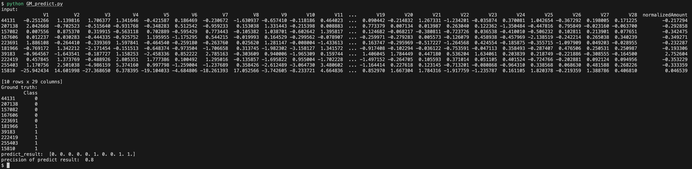

# Privacy-Preserving Research Data Sharing


> :exclamation: Please refer [here](https://hackmd.io/@petworks/S1mOhh90n) for the Chinese version of the scenario description.

Credit card fraud is a growing concern worldwide, causing huge financial losses to businesses, banks and individuals. To effectively deal with this problem, Fraud Detection System (FDS) plays an important role. Traditional centralized methods have privacy and security risks, so the joint machine learning training method can achieve collaboration while protecting privacy. Through federated learning, multiple financial institutions cooperate on the basis of a shared model, reducing the risk of sensitive data exposure while obtaining superior model performance.

## Dataset

[Credit Card Fraud Detection dataset](https://www.kaggle.com/datasets/mlg-ulb/creditcardfraud)
contains credit card transactions made by European cardholders in September 2013. Due to strict confidentiality considerations, the public data set cannot reveal specific attributes of the original data or provide comprehensive background information. Certain fields, V1, V2, …V28, of data are converted into numerical values by principal components analysis (PCA) to protect the transaction data containing customers’ personal sensitive information and provide better training results in machine learning. Principal component analysis (PCA) is fundamentally a dimensionality reduction technique designed to preserve the most critical data characteristics while reducing the overall number of dimensions. Therefore, the 28 variables represented by V1 to V28 can be viewed as condensed representations of a wider range of variables, including customer details, transaction amounts, transaction locations, etc.

Dataset field:
- Time: It represents the number of seconds from the first transaction to each transaction in the dataset.
- V1, V2, …, V28: They represent the PCA of each distinct feature data that might contain sensitive personal data.
- Amount: It represents the transaction amount.
- Class: This field represents indicates the label of each transaction. If the transaction is a case of fraud, the label is as 1. Otherwise, it is labeled as 0.
- 


## Used PETs

There are several privacy protection technologies, which can be adopted for privacy-preserving federated learning depending on the privacy protection requirements in various application scenarios. Here, we take the construction of a fraud detection system by the AI models trained by federated learning with the transaction data from distinct financial institutes as a prototype example.

* Federated Learning
Through collaborative machine learning, credit card transaction data from various financial institutions, which is distributed across multiple entities, can be utilized to train a shared fraud detection model. Each financial institution trains its own local model using its data and subsequently uploads these local model parameters to a central server for global model aggregation and updates. This approach avoids the need to transmit data to a central server, ensuring the privacy of transaction data for each financial institution.
However, in this scenario, the central server can directly access model parameters uploaded from each financial institution. Moreover, it can potentially eavesdrop on the transmission channel, gaining access to relevant information and potentially launching inference attacks. This poses a significant threat to data privacy. Therefore, when implementing federated learning, it is crucial to consider enhancing data privacy protection measures.

* Differential Privacy (Federal Learning for Privacy Enhanced Protection)
To protect against the exposure of model parameters uploaded by financial institutes to servers or potential external eavesdroppers, we integrate the concept of differential privacy into federated machine learning.
Differential privacy employs various statistical mechanisms to introduce controlled noise into model parameters, thereby preventing the disclosure of original data and enhancing privacy protection. Nevertheless, it is important to note that the introduction of noise, while enhancing privacy protection, may also have an impact on the accuracy of the model. As a result, it becomes imperative to strike a balance within a reasonable noise threshold. This balance ensures that privacy is effectively preserved while still maintaining a reasonable level of model performance.

## Goals of Using PETs

Using **federated learning** to save data in their own local systems reduces the risk of exposing sensitive data. Each local side can benefit from the shared models, which can achieve better model performance than individual training.

Using **differential privacy** prevents servers from cooperating with data providers to infer private data from model parameters uploaded by data providers. It also ensures that local model parameters can be concealed even though the disclosure of communication channels occurred. 

## Data Processing

In the privacy-enhanced federated learning architecture, each financial institution participating in the training is regarded as an independent local end. We can use servers on public cloud service platforms (such as AWS, Azure, or Google Cloud) as aggregation servers. To enhance privacy protection, differential privacy technology is also used, so the training process is as follows:
1.  The local end uses local data to train the model and adds the obtained local model parameters to the random noise of differential privacy to protect the local model parameters from direct prying by the server.
2.  Upload the protected parametric local model to the aggregation server.
3.	When the server receives the data uploaded by the local end, it aggregates the data and updates the global model after completion. The updated global model will be sent back to all local ends for a new round of training.


## Quick Start

This application has been tested using Python 3.8 on MacOS Sonoma 14.1.1 with M2 CPU and 16 GB memory.

#### Step 1. Clone the application

Clone the repo and go to the application directory.
```
git clone https://github.com/moda-gov-tw/PETs-Applications
cd PETs-Applications/federated_learning/financial_fraud_detection
```
#### Step 2. Install dependencies

Download the [dataset](https://www.kaggle.com/datasets/mlg-ulb/creditcardfraud/) and place it in `financial_fraud_detection/dataset`.

Next, install the dependencies required by the application.

```
pip install -r requirements.txt
```

After that, run the following script to preprocess the data and configure the application.
```
bash CCF_data_split_gen.sh
bash CCF_job_config_gen.sh
```

#### Step 3. Run the application

Make sure that the NVFLARE environment is set up correctly after installation, you can run an example application with The FL Simulator using the following script.

```
cd tree-based/
nvflare simulator jobs/creditcard_5_bagging_IID_split_uniform_lr -w ${PWD}/workspaces/xgboost_workspace_5_bagging_exponential_split_scaled_lr -n 5 -t 5
```

You will see the execution as shown in the picture.


Each client loads the global model and starts local training. The application will periodically print the train-auc (AUC calculated from the training dataset) and valid-auc (AUC calculated from the validation dataset).
After the federated learning phase finishes, the server will store the global model.


For more information, please refer to [the nvflare documentation](https://nvflare.readthedocs.io/en/main/index.html).

#### Step 4. Prediction by the global model

This is a simple example that utilizes a specific piece of data from the dataset to confirm that the prediction result is consistent with the ground truth. Additionally, you have the flexibility to modify the inputs yourself based on your needs.


```
cd ..
python GM_predict.py
```

###### Command Usage
```
usage: nvflare simulator [-h] -w WORKSPACE [-n N_CLIENTS] [-c CLIENTS] [-t THREADS] [-gpu GPU] job_folder

positional arguments:
job_folder

optional arguments:
-h, --help             show this help message and exit
-w WORKSPACE, --workspace WORKSPACE
WORKSPACE folder
-n N_CLIENTS, --n_clients N_CLIENTS
number of clients
-c CLIENTS, --clients CLIENTS
client names list
-t THREADS, --threads THREADS
number of parallel running clients
-gpu GPU, --gpu GPU
list of GPU Device Ids, comma separated
-m MAX_CLIENTS, --max_clients MAX_CLIENTS
maximum number of clients
```

## Disclaimer
The application listed here only serves as the minimum demonstration of using PETs. The source code should not be directly deployed for production use.
